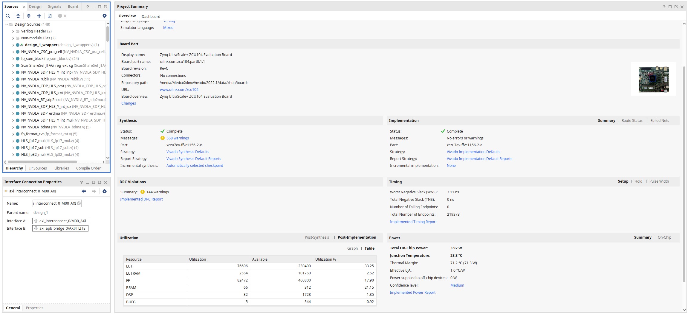
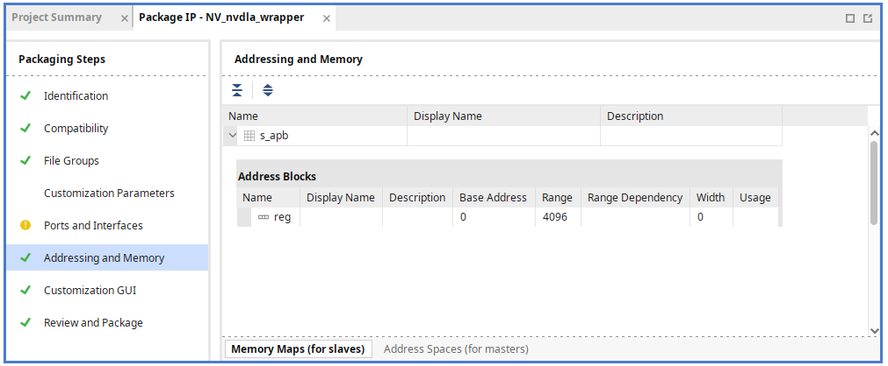
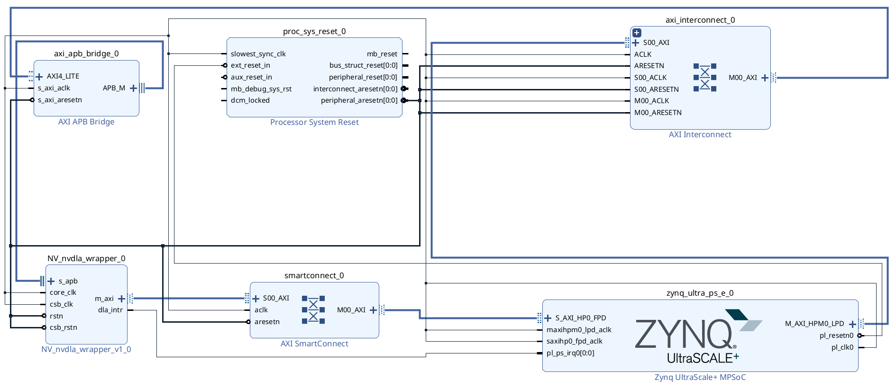
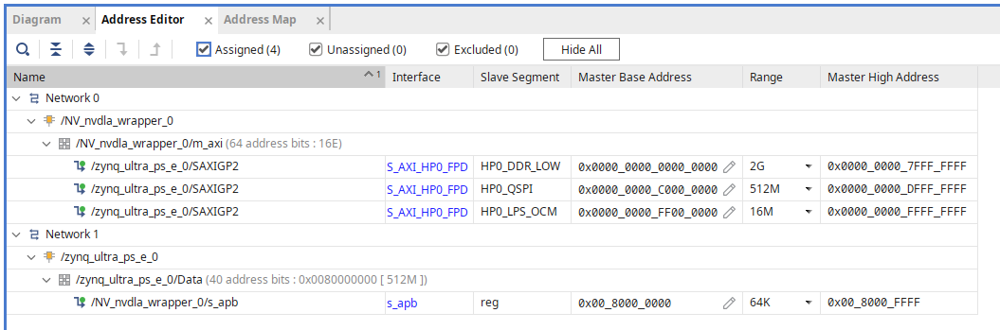
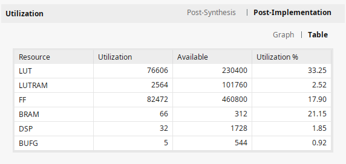

# 2. NVDLA Hardware Design Guide
This file is a guide to generating a hardware design in Vivado for the ZCU104 FPGA using the NVDLA IP core. All these steps are done in Manjaro Linux.



## 2.1 RTL Generation
### 2.1.1 Environment Setup and RTL Generation
You can try to use the official [Environment Setup Guide](http://nvdla.org/hw/v2/environment_setup_guide.html) for setup and the RTL generation, but it's really brief.

First of all, we need to clone git with the hardware description code and checkout to the `nv_small` branch.
```
git clone https://github.com/nvdla/hw
git checkout nv_small
```

Or you can use the hardware description code from my [fork](https://github.com/fmasar/nvdla_hw), it's also a submodule in this repository in the `nvdla_hw` directory.

All required tools and libraries with versions could be found in the `Makefile`.
But I think, that NVDLA hardware is not so dependent on a specific version, at least for the purpose of generating the RTL design.

As I only needed to generate the RTL design, I used these tools with the versions pre-installed on my system.
- cpp/gcc/g++ - gcc (GCC) 12.2.1 20230201
- perl - revision 5 version 36 subversion 0
- java - openjdk 20.0.1 2023-04-18
- python - Python 3.10.10
- clang - clang version 15.0.7

Once we have the hardware description code, we can configure the environment using `make`.
At this stage, you will be asked to enter the paths to the tools. You can only enter the tools listed above and skip any others.
```
cd hw
make
```

Now we can finally generate the RTL design.
```
./tools/bin/tmake -build vmod
```

The last line of the build output should look like this.
```
[TMAKE]: DONE
```

The RTL output files can be found in the `out/nv_small/vmod` directory.

#### A shorter way using Docker
You can use Docker `farhanaslam/nvdla` to avoid setting up an environment. In Docker, you can simply run `./tools/bin/tmake -build vmod` to generate the RTL design.

### 2.1.2 Modify the RTL
NVDLA is designed for ASIC, which for us means that all the components will be mapped to LUT on our FPGA. This also applies to the internal RAM, which we want to map to BRAM on the FPGA.
According to [Lei Wang's blog post](https://leiblog.wang/NVDLA-Xilinx-FPGA-Mapping/), the easiest way to do this is to delete the `synth` directory in `out/nv_small/vmod/rams`.

## 2.2 Vivado Hardware Design
### 2.2.1 Vivado Project Preparation
Create a new Vivado RTL project and select the `Zynq UltraScale+ ZCU104 Evaluation Board` or your FPGA/board, but note that this is a guide for ZCU104 so there will probably be some changes for your FPGA/board. You can also add the `vmod` directory as source or do it later.

> **_NOTE:_** I skipped adding a constraints file because I'm not going to use any IO pins from the FPGA. Do not forget to add constraints file if you want to use IO pins on your board.

We need to define some global variables for the FPGA. For example, we need to disable clock gating.
I decided to use the global variables mentioned in the [comment for the issue](https://github.com/nvdla/hw/issues/110#issuecomment-744455880) about the FPGA implementation of NVDLA. But it should work with fewer global variables, according to [Lei Wang's blog post](https://leiblog.wang/NVDLA-Xilinx-FPGA-Mapping/#1-2-2-%E5%85%B3%E9%97%AD-Clock-Gating).

From the menu bar, go to `Tools > Settings... > Project Settings > General > Language Options > Verilog options` and set the global variables (Defines).
```
VLIB_BYPASS_POWER_CG
NV_FPGA_FIFOGEN
FIFOGEN_MASTER_CLK_GATING_DISABLED
FPGA = 1
SYNTHESIS
DISABLE_TESTPOINTS
NV_SYNTHESIS
DESIGNWARE_NOEXIST = 1
RAM_DISABLE_POWER_GATING_FPGA
```

Now we will import the RTL design that we generated earlier. Add sources and select the `vmod` directory.

As we can see from the official [NVDLA documentation, Figure 1](http://nvdla.org/primer.html#id1), NVDLA uses the CSB interface to communicate with the CPU. However, there is no CSB to AXI IP core in Vivado, so we will use a built-in CSB to APB converter in the NVDLA implementation. After that, we'll be able to connect NVDLA to the CPU via the APB to AXI IP core.

Now we need a wrapper for the nvdla top and the apb2csb converter to connect these the two parts together and use it for our IP. For this purpose we'll use wrapper from [Lei Wang's blog post](https://leiblog.wang/NVDLA-Xilinx-FPGA-Mapping/#1-2-1-csb2apb).

You can copy the wrapper from [this repository](/rtl/NV_nvdla_wrapper.v), add it to your Vivado project and set it at top. The wrapper is from Lei Wang's [github repository](https://github.com/LeiWang1999/ZYNQ-NVDLA).
After that everything is ready to create our own IP core with NVDLA.

### 2.2.2 Creating the IP Core
From menu bar, go to `Tools -> Create and Package New IP...`. Select `Package your current project` option, then set the IP location and finish.

We need to associate the clock with the `m_axi` interface with clock `core_clk`.
In the package IP settings, go to tab `Ports and Interfaces` and in the `m_axi` context menu, go to `Associate Clocks...` and select `core_clk`.

There is also no address space for the `s_apb` interface. We can fix this by going to the `Addressing and Memory` tab. Select `IP Addressing and Memory Wizard` from the context menu and create a memory map for the `s_apb` interface. Then add an address block called `reg`, the range should be `4096`.



Now we have everything ready to package the IP core in the `Review and Package` tab.

### 2.2.3 Block Design
Create a new block design, add Zynq MPSoC, NVDLA, all required IP cores and connect them as shown below.



> **_NOTE:_** I used the default frequency of 100MHz for the PL0 clock.

Make sure all paths are connected.



We also need to create a wrapper for this block design with the option `Let Vivavo manage wrapper and auto-update` and set it as top.

### 2.2.4 Export Hardware and Bitstream
The last step is to export hardware and generate bitstream.
Run synthesis, implementation and then generate bitstream.

For hardware export we could not use the official way in new Vivado because we need the old HDF format. We will use old PetaLinux version which does not support new hardware format. However, we are able to generate old HDF format with command.

```
write_hwdef -force -file <location>/filename.hdf
```

> **_NOTE:_** Best practice is to use the same version of Vivado and PetaLinux. But I started hardware design in Vivado 2022.1 and then found out about the [problem with kernel version](introduction.md#14-limitations) with new PetaLinux.

Table with FPGA utilization.

