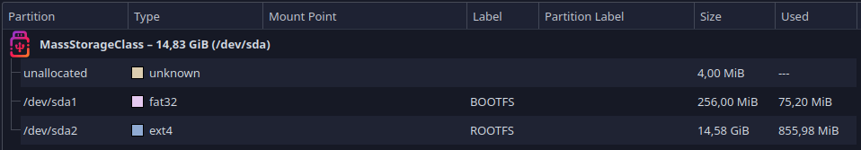

# 3. NVDLA Software Guide

This file is a guide for creating a PetaLinux project with NVDLA KMD driver and compiling NVDLA UMD runtime and compiler software. All these steps except the [3.2 SD Card Preparation](/software.md#32-sd-card-preparation) are done in the virtual machine with Ubuntu 18.04.

## 3.1 PetaLinux
### 3.1.1 Project Setup
Source PetaLinux 2019 settings and create project.
```
petalinux-create -t project --template zynqMP -n smalldla_zcu104
cd smalldla_zcu104/
```

### 3.1.2 Hardware Description
Now we need to copy the HDF file from Vivado to the project folder. The filename is arbitrary. We can also copy the bitstream into the project folder as well. After that we will load the hardware description into the project.
```
petalinux-config --get-hw-description=./
```

The `misc/config System Configuration` will appear after running the above code. We need to set `MACHINE_NAME` attribute in the `DTG Settings` to `zcu104-revc` for ZCU104. This name depends on the hardware board used.

> **_NOTE:_** See [PetaLinux Reference Guide](https://docs.xilinx.com/v/u/2019.1-English/ug1144-petalinux-tools-reference-guide) section Creating a New PetaLinux Project on page 21 for more details.

We want to use the second partition on the SD card as the root filesystem instead of the RAM filesystem. Go to `Image Packaging Configuration` and change the `Root filesystem type` value to `SD card`.


### 3.1.3 Kernel Configuration
Once we have loaded the hardware description, we can configure the Linux kernel. The kernel configuration file I used can be found in [/petalinux/kernel_config.txt](/petalinux/kernel_config.txt). The location of the kernel configuration file in the PetaLinux project is `build/tmp/work/plnx_zynqmp-xilinx-linux/linux-xlnx/4.19-xilinx-v2019.1+gitAUTOINC+9811303824-r0/linux-plnx_zynqmp-standard-build/.config`.
```
petalinux-config -c kernel
```

#### 3.1.3.1 General setup

Disable `Initial RAM filesystem and RAM disk (initramfs/initrd) support` becasue we want to use filesystem from SD card.

Enable `Compile also drivers which will not load` as we want to build everything available.

And also optionally set hostname in the `Default hostname`.

#### 3.1.3.2 Device Drivers > Graphics support
DRM drivers must be compiled as a module, otherwise loading the NVDLA driver will fail with the error "failed to register drm device".

Select these options as module (marked with M):
- Xilinx DRM
- Xilinx DRM Display Port Driver
- Xilinx DRM Display Port Subsystem Driver
- Xilinx DRM KMS Driver
- Xilinx DRM KMS bridge
- ZynqMP DP Subsystem Driver
- Xilinx DRM DSI Subsystem Driver
- Xilinx DRM Mixer Driver
- Xilinx DRM PL display driver
- Xilinx DRM SDI Subsystem Driver
- Xilinx DRM CSC Driver

Disable `Xilinx DRM Scaler Driver`.

And optinally select there options:
- Xilinx DRM DP debugfs
- Xilinx DRM DPSUB debugfs
- Xilinx DRM KMS bridge debugfs

#### 3.1.3.3 Device Drivers > PHY Subsystem
Attempting to compile the PHY driver as a module will fail. Only compiled in option will work. I tried to look for the reason, but without success.

Select `Xilinx ZynqMP PHY driver` as compiled in (marked with *).

Run the compilation after all the kernel configuration has been done.
```
petalinux-build
```

### 3.1.4 NVDLA Module
We can create the PetaLinux module for the NVDLA kernel driver once the Linux kernel configuration is done.
```
petalinux-create -t modules -n opendla --enable
```

The module folder can be found in `project-spec/meta-user/recipes-modules/opendla`.

#### 3.1.4.1 Source Code
Delete the entire contents of the `files` folder, except for `Makefile` and `COPYING`, and copy all .c and .h files from the NVDLA SW repository for the KMD driver into it. Optionally, you can also replace `COPYING` file with license.

Now we need to update the memory address for DMA for the NVDLA hardware and update the driver for Linux kernel 4.19.

Replace these lines in the `nvdla_gem.c` file:
```
dma = dma_declare_coherent_memory(drm->dev, 0xC0000000, 0xC0000000,
		0x40000000, DMA_MEMORY_MAP | DMA_MEMORY_EXCLUSIVE);
if (!(dma & DMA_MEMORY_MAP)) {
	err = -ENOMEM;
	goto unref;
}
```
with:
```
dma = dma_declare_coherent_memory(drm->dev, 0x40000000, 0x40000000,
		0x40000000, DMA_MEMORY_EXCLUSIVE);
if (dma) {
	err = -ENOMEM;
	goto unref;
}
```

Memory with start address 0x40000000 and size 0x40000000 (1GiB), which is the upper half of our DDR RAM, will be used for DMA. We assigned 2GiB DDR RAM address from 0x0 to 0x7FFFFFFF in Address Editor while creating [block design](hardware.md#223-block-design).
Removing the `DMA_MEMORY_MAP` flag and updating the condition is due to updating to Linux kernel 4.19.

> **_NOTE:_** See the documentation for the [dma_declare_coherent_memory](https://www.kernel.org/doc/html/v4.19/driver-api/infrastructure.html#c.dmam_declare_coherent_memory) function for more details.

Add a macro to `opendla.h` as we are using nv_small configuration.
```
#define DLA_2_CONFIG
```

#### 3.1.4.2 Makefile
Edit the makefile by adding all object files generated by all files.
```
###append all of sources###
opendla-objs := nvdla_core_callbacks.o nvdla_gem.o scheduler.o engine.o bdma.o conv.o sdp.o cdp.o pdp.o rubik.o cache.o common.o engine_data.o engine_isr.o engine_debug.o
###########################
```

> **_NOTE:_** See [PetaLinux Reference Guide](https://docs.xilinx.com/v/u/2019.1-English/ug1144-petalinux-tools-reference-guide) section Creating and Adding Custom Modules on page 74 for more details.

#### 3.1.4.3 BB File
Add all the NVDLA driver files to the SRC_URI variable in opendla.bb and change the licence checksum if you are replacing it with an right licence. You can use [/petalinux/opendla/opendla.bb](/petalinux/opendla/opendla.bb) as a reference.

#### 3.1.4.4 Device Tree

```
/include/ "system-conf.dtsi"
/ {
    reserved-memory {
	    #address-cells = <2>;
	    #size-cells = <2>;
	    ranges;

	    nvdla_reserved: buffer@0 {
		      no-map;
		      reg = <0x0 0x40000000 0x0 0x40000000>;
	    };
    };
};

&NV_nvdla_wrapper_0{
    compatible = "nvidia,nv_small";
    memory-region = <&nvdla_reserved>;
};
```
For memory reservation, see the PetaLinux wiki [Linux Reserved Memory](https://xilinx-wiki.atlassian.net/wiki/spaces/A/pages/18841683/Linux+Reserved+Memory).

The name `NV_nvdla_wrapper_0` is taken from the file `components/plnx_workspace/device-tree/device-tree/pl.dtsi`.

And `compatible = "nvidia,nv_small";` is the nvdla type, which must be the same as one in the [nvdla_core_callbacks.c](https://github.com/fmasar/nvdla_sw/blob/79538ba1b52b040a4a4645f630e457fa01839e90/kmd/port/linux/nvdla_core_callbacks.c#L347) file.

After setting up the device tree file, run the final build.
```
petalinux-build
```

### 3.1.5 PetaLinux Project Packaging
Run the command to package the PetaLinux project, where ./nvdla_zcu104.bit is the path to the bitstream generated by Vivado.
```
petalinux-package --boot --fsbl images/linux/zynqmp_fsbl.elf --fpga ./nvdla_zcu104.bit --u-boot --force
```

## 3.2 SD Card Preparation
Create partitions on the SD card similar to the image below. First 4 MiB must be unallocated, then create at least 60 MiB FAT32 partition, followed by EXT4 partition with the rest of the space. All partitions should be aligned at 4MiB for optimal performance.


Copy `BOOT.BIN` and `image.ub` to the first (BOOTFS) partition.

Then copy root fs to the second partition (ROOTFS). The [PetaLinux Reference Guide](https://docs.xilinx.com/v/u/2019.1-English/ug1144-petalinux-tools-reference-guide) says to extract rootfs from the rootfs.tar.gz file, but I used the rootfs.ext4 file instead.
```
sudo mount rootfs.ext4 /mnt
sudo rsync -avh --info=progress2 /mnt/ <path to the ROOTFS from SD card>
sudo umount /mnt
```

> **_NOTE:_** See [PetaLinux Reference Guide](https://docs.xilinx.com/v/u/2019.1-English/ug1144-petalinux-tools-reference-guide) section Configuring SD Card ext File System Boot on page 64 for more details.

Now Linux should be able to boot from the SD card, but we still have no runtime software and no CNN to run.

## 3.3 UMD - Runtime
The easiest way to get started is to use the prebuilt [nvdla_runtime](https://github.com/fmasar/nvdla_sw/tree/master/prebuilt/arm64-linux). However, we can build our own NVDLA runtime.

### 3.3.1 Preparing Environment
First we need to install the gcc-aarch64-linux-gnu, g++-aarch64-linux-gnu and binutils-aarch64-linux-gnu packages.
```
sudo apt install gcc-aarch64-linux-gnu g++-aarch64-linux-gnu binutils-aarch64-linux-gnu
```

### 3.3.2 Compilation of jpeg library
The NVDLA SW includes precompiled jpeg library, but it is not compatible with newer versions of glibc, so we need to compile our own. NVDLA uses jpeg version 6, which I tried to cross-compile, but it failed right at the start of running the configure script. More specifically, I was unable to run the configure script due to an error `bash: ./configure: /bin/sh^M: bad interpreter: No such file or directory`. So I compiled jpeg version 9 instead, which is also compatible and compiles better.

Download and extract the jpeg source archive.
```
wget http://www.ijg.org/files/jpegsrc.v9.tar.gz
tar -xzvf jpegsrc.v9.tar.gz
cd jpeg
cd jpeg-9/
```

Configure, compile and packed into static library.
```
./configure --host=aarch64-linux CC=aarch64-linux-gnu-gcc
make -j8
ar rc libjpeg.a *.o
```

> **_NOTE:_** See the install.txt file in the jpeg source code for more details.

### 3.3.3 Upgrading jpeg Library
Replace the new `libjpeg.a` in the `<nvdla sw>/umd/external` folder and the new `jpeglib.h`, `jmorecfg.h` and `jconfig.h` in the `<nvdla sw>/umd/external/include` folder.

For some reason, the jpeg library defines its own boolean type instead of the C++ bool type if you do not define the HAVE_BOOLEAN macro. So we have to replace this line in DlaImageUtils.cpp:196
```
jpeg_read_header(&info, true);
```
with
```
jpeg_read_header(&info, TRUE);
```

### 3.3.4 UMD Runtime Compilation
Now everything is ready to compile nvdla_runtime using the command below.
```
cd umd
export TOP=$(pwd)
make runtime TOOLCHAIN_PREFIX=/usr/bin/aarch64-linux-gnu- -j8
```

After successful compilation there will be an executable file for aarch64 named `nvdla_runtime` in the folder `<nvdla sw>/umd/out/apps/runtime/nvdla_runtime` with shared object named `libnvdla_runtime.so` in `<nvdla sw>/umd/out/core/src/runtime/nvdla_runtime`.

Now copy them to the home directory on the SD card.

## 3.4 UMD - Compiler
As with nvdla_runtime, there is a prebuilt version of [nvdla_compiler](https://github.com/fmasar/nvdla_sw/tree/master/prebuilt/x86-ubuntu). However, there is a guide on how to build the compiler from source if needed.

### 3.4.1 Compiling protobuf library
The NVDLA SW repository contains the protobuf library source code in the `<nvdla sw>/umd/external/protobuf-2.6` directory.
```
cd umd/external/protobuf-2.6
./autogen.sh 
./configure
make -j8
```

After successful compilation, the `libprotobuf.a` library will be in the `src/.libs` folder.
```
cp src/.libs/libprotobuf.a ../../apps/compiler
```

### 3.4.2 Compiling NVDLA compiler
Now everything is ready to compile nvdla_compiler using the command below.
```
cd umd
export TOP=$(pwd)
make compiler TOOLCHAIN_PREFIX=/usr/bin/ -j8
```

After successful compilation there will be an executable file for AMD64 named `nvdla_compiler` in the folder `<nvdla sw>/umd/out/apps/compiler/nvdla_compiler` with shared object named `libnvdla_compiler.so` in `<nvdla sw>/umd/out/core/src/compiler/nvdla_compiler`.
